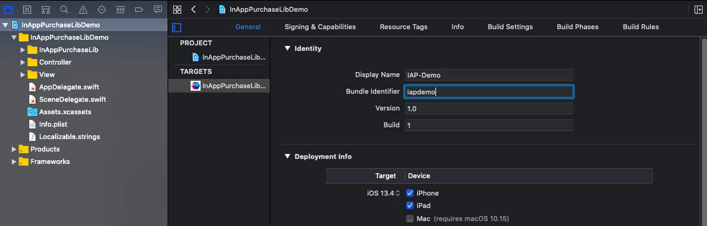

# In-App Purchase Swift Library - Xcode Demo Project.
See InAppPurchaseLib on GitHub: [iap-swift-lib](https://github.com/iridescent-dev/iap-swift-lib).

<p align="center">
  <a href="https://github.com/iridescent-dev/iap-swift-lib">
    
  </a>
</p>

- [Getting Started](#getting-started)
  - [Requirements](#requirements)
  - [Installation](#installation)
- [License](#license)


## Getting Started

### Requirements
* Configure your App and Xcode to support In-App Purchases.
  * [In-App Purchase Overview](https://developer.apple.com/in-app-purchase)
  * [StoreKit Documentation](https://developer.apple.com/documentation/storekit/in-app_purchase)
* Create and configure your [Fovea.Billing](https://billing.fovea.cc) project account:
  * Set your bundle ID
  * The iOS Shared Secret (or shared key) is to be retrieved from [AppStoreConnect](https://appstoreconnect.apple.com/)
  * The iOS Subscription Status URL (only if you want subscriptions)


### Installation
* Clone iap-swift-lib-demo to your computer and use it in Xcode:
  * *Clone or download* > *Open in Xcode*
  
* Set your App Store Connect project information:
  * Edit the Bundle Identifier.
    <p align="center">
      
    </p>
  * Open the `AppDelegate.swift` file to edit product information and Fovea.Billing validation URL.
  
    ``` swift
    InAppPurchase.initialize(
        iapProducts: [
            IAPProduct(productIdentifier: "monthly_plan", productType: .autoRenewableSubscription),
            IAPProduct(productIdentifier: "yearly_plan", productType: .autoRenewableSubscription)
        ],
        iapPurchaseDelegate: PurchaseDelegate(),
        validatorUrlString: "https://validator.fovea.cc/v1/validate?appName=iapdemo&apiKey=12345678"
    )
    ```


## License
InAppPurchaseLib is open-sourced library licensed under the MIT License. See [LICENSE](LICENSE) for details.
